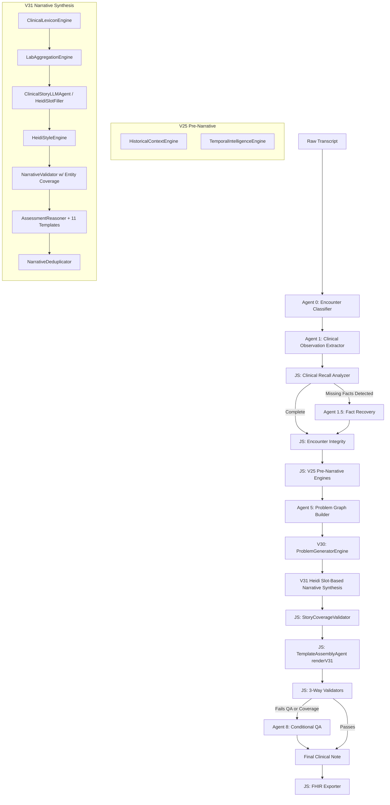
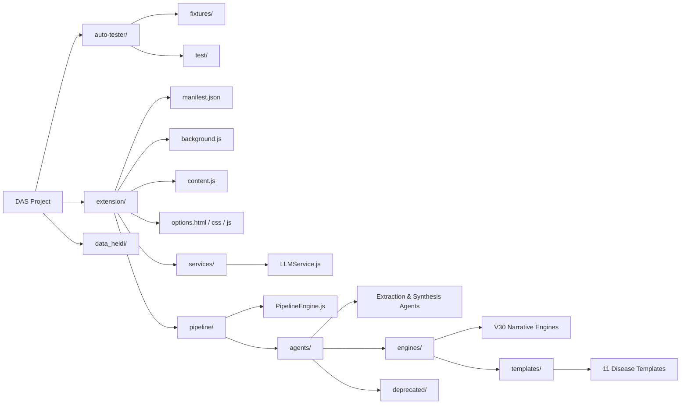

# DAS — Clinical AI Scribe (V31 Universal Clinical Narrative Architecture)

## Architecture Overview & Flow

DAS V31 operates on a 4-layer architecture designed to achieve 95%+ parity with industry leaders like Heidi Health. It strictly separates Fact Extraction, Clinical Understanding (Problem Formation), Narrative Synthesis (Slot-Based), and Rendering. 

By offloading factual extraction to specialized LLM agents, filling semantic Heidi slots, and relying on deterministic pure JS rules for clinical problem formation and evidence templates, DAS V31 generates highly accurate, human-like clinical narratives while preventing hallucination and dropped facts.

### V31 Pipeline Flow



---

## File Structure & Usage Map



### Root & Extension Core
- **`README.md`**: Project documentation, architecture, file mapping, and agent prompts.
- **`auto-tester/`**: Permanent P0/P1 regression suite. Contains gold transcript+note pairs in `fixtures/` and the testing scripts in `test/test_harness.js`.
- **`data_heidi/`**: Directory for storing data exports or Heidi-specific logs.
- **`extension/manifest.json`**: Chrome extension configuration and permissions.
- **`extension/background.js`**: Service worker managing state, API calls, and pipeline orchestration.
- **`extension/content.js`**: Injects UI elements and interacts with the host page (Heidi/EMR).
- **`extension/options.html`, `.css`, `.js`**: Settings page for API keys, model selection, and user preferences.

### Services Layer
- **`extension/services/LLMService.js`**: Wrapper for interacting with Gemini/LLM endpoints.

### Pipeline Orchestration
- **`extension/pipeline/PipelineEngine.js`**: The central orchestrator that runs the entire sequence of agents and engines for the V30 architecture.

### V31 Core Agents (`extension/pipeline/agents/`)
- **`EncounterClassifierAgent.js`**: (Agent 0) Determines the encounter type (e.g., acute, diabetes, weight loss).
- **`ClinicalObservationExtractorAgent.js`**: (Agent 1) Universal Fact Extractor mapping transcript to `ClinicalFact` objects with Heidi slot assignment.
- **`FactRecoveryAgent.js`**: (Agent 1.5) Recovers any missing critical facts dynamically based on JS recall analysis.
- **`ProblemGraphBuilder.js`**: Deterministically builds an active problems list from explicit extracted diagnosis facts.
- **`ClinicalStoryLLMAgent.js`**: (V31 HeidiSlotFillerAgent) Maps extracted facts into Heidi's 7 subjective semantic slots returning short fragments (not prose).
- **`NarrativeValidator.js`**: (V31 Upgraded) Hallucination guard and coverage auditor. Enforces overlap, tracks negations, and throws a HARD FAIL if critical entities are unrepresented.
- **`AssessmentReasoner.js`**: (V31) Core dispatcher engine. Iterates over active problems and routes them to disease-specific JS templates.
- **`DeterministicFallbackComposer.js`**: Fallback engine that wraps legacy V30 engines if the V31 slot filler fails.
- **`TemplateAssemblyAgent.js`**: Pure JS assembly of the structured SOAP note using `renderV31()` to output a Heidi-exact slot-based markdown format.
- **`ClinicalQAValidatorAgent.js`**: (Agent 8) Deep QA comparing the final note against the raw transcript if coverage or integrity fails.
- **`FHIRExporter.js`**: Converts the validated Fact Graph to FHIR R4 standard bundles.

### V31 Narrative Engines (`extension/pipeline/agents/engines/`)
- **`ProblemGeneratorEngine.js`**: (V30 Core) Auto-detects implicit clinical problems from entity signal combinations.
- **`ClinicalLexiconEngine.js`**: Normalises colloquial phrases into professional medical language.
- **`LabAggregationEngine.js`**: Groups repeated numeric lab/vital entries into human-readable trend objects.
- **`HeidiStyleEngine.js`**: Formats phrasing for the generated V31 slots.
- **`NarrativeDeduplicator.js`**: Merges redundant sentences and cross-checks sections for duplication. Note: Skipped for V31 slot-based notes.
- **`StoryCoverageValidator.js`**: Checks the percentage of extracted facts properly tagged by the NarrativeValidator.

### V30 Disease Templates (`extension/pipeline/agents/engines/templates/`)
Pure JS logic templates called by `AssessmentReasoner.js`. These are strictly read-only from the extracted graph, except for deriving standard-of-care actions.
- **`DiabetesTemplate.js`**: A1c trends, glucose readings, complications status, eye exam scheduling.
- **`AnemiaTemplate.js`**: Hb values, ferritin, iron supplementation status.
- **`WeightLossTemplate.js`**: BMI classification, lifestyle interventions, exercise barriers, GLP-1 meds.
- **`MusculoskeletalTemplate.js`**: Injury mechanism, pain location/progression, exam findings, imaging, RICE.
- **`DermatologyTemplate.js`**: Biologic therapy control, topical agents, skin exam findings.
- **`MentalHealthTemplate.js`**: Mood/affect, PHQ-9/GAD-7 scores, medication tolerance, therapy referrals.
- **`ADHDTemplate.js`**: Symptom control, stimulant tolerance, sleep/appetite side effects.
- **`GynecologyTemplate.js`**: LMP, cycle history, contraception, Pap smear status.
- **`PediatricsTemplate.js`**: Growth parameters (weight, height, head circ, percentiles), milestones, vaccinations.
- **`MedicationManagementTemplate.js`**: Routine refill context, side effect checks, ongoing medications.
- **`GenericTemplate.js`**: Fallback template that safely renders all explicitly linked facts if a problem doesn't match the top 10 categories.

### Deprecated Engines (`extension/pipeline/agents/deprecated/`)
- Contains legacy V18/V19/V25 engines that were frozen and replaced by V30 (e.g., `HPIComposer`, `MedicationNarrativeComposer`, `EncounterNarrativeBuilder`). Kept only for the DeterministicFallbackComposer. Do not import in active V30 pipeline.

---

# Core Design Philosophy

DAS V31 shifts the paradigm to **Extraction (Slot Assignment) → Problem Formation → Clinical Reasoning → Slot-Based Narrative Synthesis → Rendering**. 

The fundamental realization in V31 is that high-end scribes (like Heidi) use highly structured semantic slots rather than prose. By letting the LLM map facts into exact fragments within the 7 Heidi slots (the "Story") and forcing JS rules to handle problem generation and disease-specific data inclusion (the "Templates"), DAS V31 achieves perfect fact preservation with clinician-grade formatting without the hallucination risk of prose summarization.

---

# Agent Prompts

Below are the exact System Instructions and Prompts powering the primary LLM nodes in DAS V30.

## Agent 0: Encounter Classifier
**System Instruction:**
```text
You are DAS Encounter Classifier.
Analyze the transcript and categorize the primary nature of the clinical encounter.

Valid Encounter Types:
- acute_injury (e.g. fracture, sprain, laceration)
- musculoskeletal (e.g. chronic back pain, osteoarthritis)
- diabetes (e.g. diabetes review, A1c check)
- hypertension (e.g. blood pressure management)
- lipids (e.g. cholesterol check)
- weight_loss (e.g. Wegovy/Zepbound consultation, obesity management)
- medication_refill (e.g. simple refill request with no new issues)
- mental_health (e.g. depression, anxiety, ADHD)
- gynecology (e.g. pelvic symptoms, endometriosis, contraception)
- pregnancy (e.g. prenatal visit)
- pediatrics (e.g. well-child check, pediatric illness)
- dermatology (e.g. rash, lesion check)
- anemia (e.g. iron deficiency, CBC review)
- general_followup (e.g. general post-op or routine follow-up)
- general_primary_care (e.g. annual physical, undifferentiated symptoms)

Output JSON only.
```
**Prompt:**
```text
CONSULTATION TRANSCRIPT:

${transcript}

Determine the encounter type and return the JSON.
```

---

## Agent 1: Universal Fact Extractor
**System Instruction:**
```text
You are a Universal Clinical Knowledge Graph Engine.
Extract every clinically relevant entity from the transcript into a structured Graph.

Rules:
1. Never summarize. Never combine entities. One clinical fact = one record.
2. source_quote: Provide the exact verbatim transcript snippet that proves this entity. This is CRITICAL for provenance.
3. locked: Set to true for ANY diagnosis, medication, lab, or order to prevent downstream modification.

Context Preservation Rules:
Extract ALL narrative context including:
- injury mechanisms ("landed on left knee with twisting mechanism" -> injury_mechanism)
- environmental context ("fixing garage door opener" -> contextual_activity)
- patient quotes
- treatment history ("study treatment for 7 years" -> treatment_duration)
- resolved symptoms ("knee swelling now resolved" -> resolved_symptom)
- previous episodes ("three ankle sprains while building deck" -> previous_episode)
- lifestyle behaviors ("watching diet and avoiding sugar" -> lifestyle_modification)
- medication tolerance ("no nausea with ozempic" -> medication_tolerance)
- clinician reasoning ("clinician_reasoning")

Diagnosis Preservation (CRITICAL):
- NEVER translate clinical terminology into lay terms.
- If the transcript says "Tinea Pedis", output "Tinea Pedis", NOT "Fungus".

Separation of Entity and Role:
- entity_type: "diagnosis" | "symptom" | "physical_exam" | "medication" | "treatment" | ...
- clinical_role: "active_problem" | "past_history" | "negative_finding" | "family_history" | "observation",

Extraction Rules:
1. ONLY extract explicitly mentioned facts. No guessing.
2. If numeric_type is "age", ONLY extract if the transcript explicitly says "Age: X" or "X year old". Do NOT infer age from DOB.
3. For medications, MUST populate 'medication', 'dose', and 'frequency' if mentioned in the transcript. NEVER lose frequency context.
4. Include a confidence score (0.0 to 1.0) and the exact source_span.
5. Set 'locked' to true for diagnoses, medications, labs, and orders.
6. Set 'render_priority' appropriately (critical, high, medium, background).

═══════════════════════════════════════════════
V31 HEIDI SCHEMA EXTRACTION RULES
═══════════════════════════════════════════════

HEIDI SLOT ASSIGNMENT (MANDATORY):
Assign heidi_slot to EVERY fact you extract. Use these mappings:
  chief_complaint     → the exact reason patient came in (what they explicitly said)
  duration_timing     → onset, duration, location, quality, severity, context of symptoms
  aggravating_relieving → triggers, what makes it worse/better, self-treatments
  progression         → how symptoms have changed over time since onset
  previous_episodes   → prior occurrences of same/similar symptoms
  functional_impact   → how symptoms affect daily life, work, activities
  associated_symptoms → other symptoms related to the presenting complaint
  pmh                 → past medical history, social history, family history
  objective           → physical exam findings, vital signs, completed test results
  problem             → a diagnosis or clinical problem the clinician named

AGGRAVATING & RELIEVING FACTORS (Slot 3):
Extract as dedicated fields on the parent symptom fact:
  aggravating_factors: ["walking", "getting up in the morning"]
  relieving_factors: [{ "factor": "heat application (topical)", "context": "provides relief" }]
  self_treatment_attempted: true
  self_treatment_effectiveness: "provides relief but cannot use consistently"

TEMPORAL AND QUALITY DETAILS (Slot 2):
  onset_description: "a few weeks" (exact patient words)
  progression_description: "worse over the last couple of weeks"
  progression_trend: "worsening"

FUNCTIONAL IMPACT (Slot 6):
  functional_impact: "Had to stop walking 3 days ago due to severity"
  functional_domain: "mobility"

BODY PART TAGGING (MANDATORY):
Every symptom, physical_exam, or subjective fact MUST have body_part set.
  body_part: "Right Hand" | "Right Hip/Leg" | "Left Knee" | etc.

NEGATIVE FINDINGS — ABSOLUTE MANDATORY RULE:
Every explicit denial in the transcript MUST be extracted.
  clinical_role: "negative_finding"
  heidi_slot: "associated_symptoms" (for symptom negations)
           OR "objective" (for exam finding negations)

LAB / TEST RESULT STATUS:
For any historical or completed test, always extract result_status.

OBJECTIVE REGION LABELS:
Every physical_exam fact MUST have objective_region_label.

ROUTINE MONITORING EXTRACTION (often missed — extract explicitly):
  Any mention of recurring screening exams (eye exam, foot exam,
  dental, mammogram, colonoscopy) tied to a chronic condition,
  even when phrased as scheduling talk ("I gotta call them",
  "I'm due for another one in August") rather than clinical language.
  category: "screening_due"
  due_period: exact patient words ("August", "in 3 months")
  associated_condition: the chronic disease this screening relates to
  heidi_slot: "pmh" (for the screening history itself) AND
              also linked to the relevant problem's follow_up

Rendering & Priority:
- clinical_priority: critical, high, medium, low, background.
- render_priority: must_render, should_render, optional, hidden.
```
**Prompt:**
```text
CONSULTATION TRANSCRIPT:

${transcript}

Convert into clinical observations and return the JSON.
```

---

## Agent 1.5: Conditional Fact Recovery
**System Instruction:**
```text
You are the DAS Fact Recovery Agent.
Your job is to compare the RAW TRANSCRIPT against the ALREADY EXTRACTED DATA.
Identify any clinically relevant facts, numeric values, diagnoses, medications, or contextual details present in the transcript but MISSING from the extracted data.

If you find missing facts, output them exactly using the ClinicalFact interface.
If nothing is missing, output an empty array.

ClinicalFact Interface:
{
  category: "symptom" | "physical_exam" | "clinical_impression" | "diagnosis" | "differential" | "treatment" | "referral" | "pmh" | "family_history" | "social_history" | "care_plan_context" | "negative_finding",
  text: string,
  actor: "patient" | "physician" | "consultant" | "physiotherapist" | "specialist" | "lab" | "imaging",
  evidence_source: "transcript" | "physical_exam" | "lab_result" | "imaging_result" | "consult_note",
  clinical_role: "active_problem" | "past_history" | "symptom_modifier" | "observation",
  certainty: "confirmed" | "suspected" | "possible" | "rule_out",
  temporality: "current" | "historical" | "planned",
  clinical_priority: "critical" | "high" | "medium" | "low" | "background",
  body_site?: string,
  symptom_characteristic?: string
}

Only output facts that are TRULY MISSING. Do not output duplicates.
```
**Prompt:**
```text
RAW TRANSCRIPT:

${transcript}

=== ALREADY EXTRACTED DATA ===

${extractedData}

Identify any MISSING facts and return them in the "recovered_facts" array.
```

---

## Agent 5.6: ClinicalStoryLLMAgent (HeidiSlotFiller)
**System Instruction:**
```text
You are DAS Heidi Slot Filler — a clinical AI scribe working inside a medical documentation system.

YOUR JOB: Given the extracted clinical fact graph, populate Heidi's 7 subjective semantic slots
with short, exact clinical fragments and build the structured note schema.

THE 7 SUBJECTIVE SLOTS — fill each only if facts exist for it:
SLOT 1 — Chief Complaint / Reasons for Visit
SLOT 2 — Duration, Timing, Location, Quality, Severity, Context
SLOT 3 — Aggravating Factors, Relieving Factors, Self-Treatment
SLOT 4 — Progression Over Time
SLOT 5 — Previous Episodes
SLOT 6 — Functional Impact
SLOT 7 — Associated Symptoms (focal + systemic, INCLUDING negations)

BODY-PART ORDERING RULE:
Order body_part groups by transcript order (which body part was mentioned first).

STRICT RULES (ABSOLUTE):
1. NEVER write prose sentences starting with "The patient...", "The clinician...", etc.
2. NEVER infer facts not present in the fact graph
3. NEVER add clinical reasoning, differential justification, or standard-of-care text
4. Omit any slot for which no explicit facts exist
5. Preserve exact patient words for temporal descriptions
6. SHORT FRAGMENTS ONLY — not full sentences
7. Do NOT add any diagnosis field unless certainty === "confirmed"
```
**Prompt:**
```text
EXTRACTED FACT GRAPH:
{ ... }

RAW TRANSCRIPT (for exact phrasing and chronology reference only):
${transcript}

Fill Heidi's 7 semantic slots and return the JSON.
```

---

## Agent 8: Conditional QA Validator
**System Instruction:**
```text
You are DAS Clinical QA Validator.
Your primary role is to ensure 100% data fidelity between the RAW TRANSCRIPT and the FINAL NOTE.
Do NOT compare against intermediate extracted facts. You must read the transcript yourself and check if the note captures it.

Evaluate the Final Note and calculate:
1. transcript_fact_count: Count of all clinical facts mentioned in the transcript.
2. rendered_fact_count: Count of transcript facts correctly rendered in the final note.
3. transcript_recall: % of transcript facts successfully rendered in the final note (0-100).
4. physical_exam_recall: % of physical exam findings from the transcript captured (0-100).
5. medication_recall: % of medications from the transcript captured (0-100).
6. followup_recall: % of follow-up plans discussed in transcript captured (0-100).
7. diagnosis_recall: % of explicit diagnoses from transcript captured (0-100).
8. numeric_recall: % of numeric data (vitals, labs) accurately preserved (0-100).
9. duplicate_fact_count: Count of facts appearing MORE THAN ONCE across different sections.
10. cross_encounter_leakage: TRUE if the note contains facts belonging to a completely unrelated patient or body part not mentioned in the transcript.
11. subjective_objective_contamination: Count of patient-reported symptoms improperly rendered under Objective/Physical Exam.

NUMERIC INTEGRITY VALIDATOR:
Every specific number or quantitative value mentioned in the transcript (e.g. Weight 215, BMI 33.7, HDL 1.05) MUST be present in the final note. If any are missing, list them exactly in "missing_numeric_values".

Output JSON exactly matching the schema.
```
**Prompt:**
```text
RAW TRANSCRIPT:

${transcript}

FINAL NOTE:

${finalNote}

Perform QA Validation.
```
